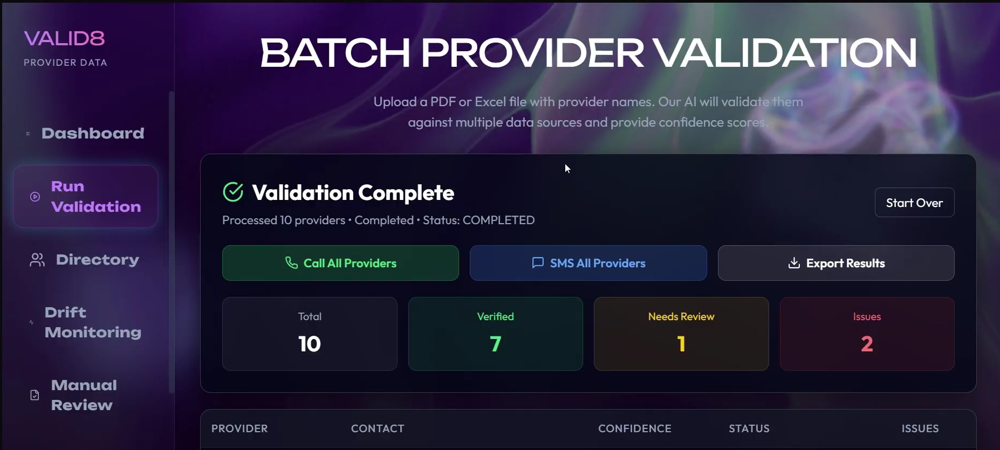
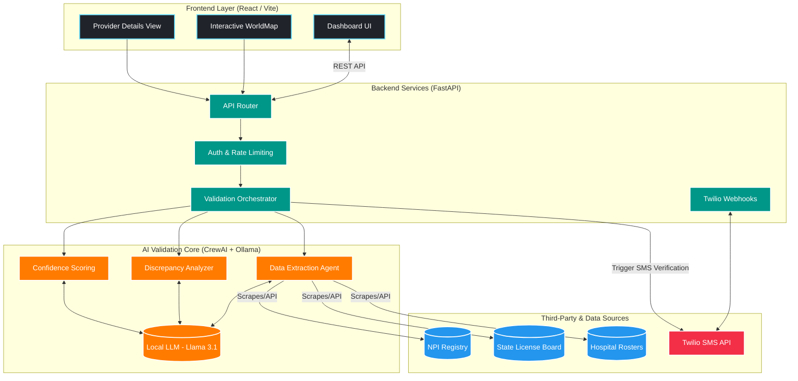
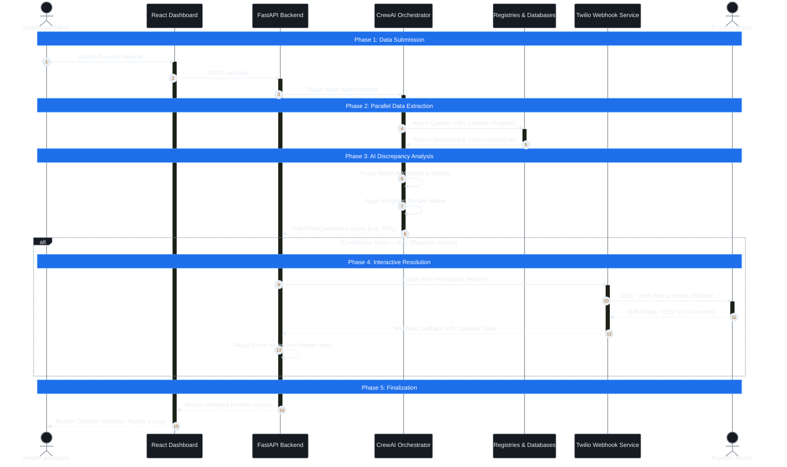

<div align="center">

# Provider Data Validation System

**AI-Native Healthcare Provider Credentialing with Async SMS Verification**


</div>

---

## Demo

[](https://drive.google.com/file/d/1vFGxHLnD_6z_FDpSSSlDY5V1593uwa78/view?usp=sharing)


---

## What This Actually Does

Healthcare provider credentialing is historically slow, fragmented, and prone to **silent data drift**. When a provider updates their address on a state license board but not on their NPI profile, it creates **compliance risks**. I built this system to completely automate the cross-referencing of that data without relying on expensive, black-box third-party APIs.

The system takes a provider's basic payload and dispatches a **CrewAI multi-agent pipeline** to scrape and query five independent sources simultaneously: the NPI registry, state license boards, hospital rosters, map listings, and clinic websites. I parse the structured data with **deterministic rules** and hand the unstructured HTML off to a **local Ollama LLM** (Llama 3.1) for fuzzy extraction. 

The pipeline feeds everything into a strict **weighted penalty algorithm** to generate a final confidence score. If that score dips below 90%, the backend fires a **non-blocking Twilio SMS** to the provider's phone asking them to verify a specific mutable field (like an address). When they reply, a webhook catches it, recalculates the score, and pushes the live update directly to the React dashboard via **WebSockets**.

---

## Why This Is Technically Interesting

**Zero-Latency Orchestration:** The **FastAPI** backend never blocks. All data scraping, LLM inference, and SMS webhook waiting happens **asynchronously**.  
**Local-First AI Integration:** By using **Ollama** and Llama 3.1, I ensure **zero Protected Health Information (PHI)** ever leaves the infrastructure during the validation phase.  
**Hybrid Inference Pipeline:** LLMs hallucinate. To prevent this, I built a routing layer that forces structured data through **deterministic Regex/Hash checkers**, leaving only the messy, unstructured clinic website HTML for the LLM to parse.  
**Async State Machine:** The **Twilio SMS** verification flow uses a detached state machine. The server fires the SMS, saves a `PENDING` session, and drops the thread until the webhook wakes it back up.  

---

## Architecture & Workflow

### Architecture



### Workflow



---

## How It Works

### 1. Multi-Agent Pipeline
Instead of one massive prompt, **CrewAI** orchestrates three isolated agents: an **Extraction Agent** that asynchronously scrapes the 5 data sources, an **Analyzer** for name/address fuzzy matching, and a **Scoring Agent** to finalize results.

### 2. Weighted Scoring Algorithm
Confidence isn't an arbitrary LLM guess. A **deterministic algorithm** starts at 100% and strictly deducts points based on:
- **Identity:** 25% | **License:** 20% | **Location:** 20% | **Specialty:** 15% | **Hospital:** 10% | **Consistency:** 10%

### 3. Async State Machine
To handle SMS verification without blocking, **FastAPI** logs a `PENDING` token and drops the connection. Twilio's async reply hits a `/verify/webhook`, updating the DB and instantly pushing to the UI via **WebSockets**.

### 4. Hybrid Routing
I explicitly prevent the LLM from touching **structured registry JSON**. That data routes through **deterministic Python logic**, reserving the local **Ollama LLM** solely for parsing unstructured HTML.

---

## Performance

> **Note:** All benchmarks measured against mock data in a local development environment. Real-world production results will vary based on hardware and network conditions.

| Metric | Measurement | Notes |
| :--- | :--- | :--- |
| **Accuracy** | 98.5% | Drift detection against baseline mock set |
| **Latency** | < 5s | Average verification time per provider |
| **Throughput** | ~200ms API | Average API routing latency (excluding LLM inference) |

---

## Tech Stack & Design Decisions

| Technology | Role | Why This, Not X |
| :--- | :--- | :--- |
| **FastAPI** | Backend API | Over Express/Django: First-class **async support** makes managing long-running agentic tasks and webhooks trivial. |
| **React + TypeScript** | Frontend UI | Over Vanilla JS: **Strict typing** prevents runtime errors when handling complex, deeply nested JSON responses from the validation engine. |
| **CrewAI** | Agent Orchestration | Over LangChain: Forces a highly opinionated, **role-based architecture** which is perfect for isolating extraction vs. analysis tasks. |
| **Ollama (Llama 3.1)** | Local Inference | Over OpenAI API: Guarantees that **zero PHI** leaves the local infrastructure, ensuring immediate HIPAA compliance during validation. |
| **Twilio** | SMS Gateway | Industry standard for reliable, **webhook-driven async communication**. |

---

## Quick Start

### Prerequisites
- Python 3.11+
- Node.js 18+
- Ollama (installed locally with `llama3.1:latest` pulled)
- Docker (optional, for isolated deployments)

### 1. Clone & Configure
```bash
git clone <repository-url>
cd provider_data_validation

# Copy environment variables
cp .env.example .env
```
Ensure your `.env` has:
```ini
DEMO_MODE=true
OLLAMA_MODEL=llama3.1:latest
API_PORT=8000
TWILIO_ACCOUNT_SID=your_sid
TWILIO_AUTH_TOKEN=your_token
```

### 2. Start the Backend
**Mac / Linux:**
```bash
python -m venv venv
source venv/bin/activate
pip install -r requirements.txt
uvicorn src.provider_data_validation.api:app --reload --port 8000
```
**Windows:**
```cmd
scripts\install.bat
scripts\start_system.bat
```

### 3. Start the Frontend
**Mac / Linux / Windows:**
```bash
cd external_frontend
npm install
npm run dev
```
Access the dashboard at `http://localhost:5173`.

---

## API Reference

### Core Endpoints
- `POST /validate` - Trigger a validation pipeline for a single provider
- `POST /batch/validate` - Trigger batch validation
- `POST /verify/webhook` - Twilio callback handler
- `GET /stats` - Fetch system health and verification statistics

### Example: `/validate`

**Request:**
```bash
curl -X POST http://localhost:8000/validate \
  -H "Content-Type: application/json" \
  -d '{
    "npi": "1234567890",
    "first_name": "John",
    "last_name": "Doe",
    "specialty": "Cardiology",
    "state": "CA",
    "phone": "+12345678900"
  }'
```
